# VPP 虚拟电厂管理平台（后端）

> 基于 Spring Cloud 微服务架构的虚拟电厂（Virtual Power Plant）管理平台，实现"资源管理 → 事件申报 → 调度分配 → 执行监测 → 效果评估 → 结算分账"全流程闭环。

## 演示环境

- 地址：https://vpp-pc.huizhidata.com
- 账号 / 密码：`xndc` / `admin123`
- 目前演示地址权限全开,请勿随意删除相关数据,本人只做了初始化数据库备份,如果出现异常情况,会选择直接回滚初始版本

## 项目地址

- 后端：https://github.com/roinli/govpp-cloud（当前）
- 前端：https://github.com/roinli/govpp-admin

## 文档地址

- https://vpp-doc.huizhidata.com

## 个人博客

- https://wenhui.huizhidata.com

## 技术栈

| 组件 | 版本 | 说明 |
|---|---|---|
| JDK | 1.8 | 编译运行环境 |
| Spring Boot | 2.7.18 | 基础框架 |
| Spring Cloud | 2021.0.8 | 微服务框架 |
| Spring Cloud Alibaba | 2021.0.5.0 | 微服务增强 |
| Nacos | 2.1.1 | 服务注册 & 配置中心 |
| MyBatis Plus | 3.5.0 | ORM 增强 & 多租户 |
| MySQL | 8.0 | 关系型数据库 |
| Redis | — | 缓存 & 会话管理 |
| JWT | 0.9.1 | 认证令牌 |
| Druid | 1.2.16 | 数据库连接池 |
| Swagger / SpringFox | 3.0.0 | 接口文档 |

## 业务模块

```
资源管理（场站 / 充电桩）
    ↓
需求响应事件（削峰 / 填谷）
    ↓
事件申报（申报容量 ≤ 可调容量）
    ↓
调度分配（按可调容量比例分配目标功率）
    ↓
指令下发 & 执行监测（目标曲线 vs 实际曲线，偏差告警）
    ↓
效果评估（基线计算、响应电量、合格判定）
    ↓
结算分账（响应电量 × 单价，平台 / 运营商 / 场站分成）
```

## 系统模块

```
com.witos (vpp)
├── pc_web                    // 前端框架 [80]
├── vpp-gateway               // 网关模块 [38080]
├── vpp-auth                  // 认证中心 [39200]
├── vpp-api                   // 接口模块
│       └── vpp-api-system    //   系统接口
├── vpp-event-service         // 事件服务（事件 + 申报 + 资源）
├── vpp-dispatch-service      // 调度服务（分配 + 执行 + 评估 + 结算）
├── vpp-register              // 服务注册中心
├── vpp-common                // 通用模块
│       ├── vpp-common-core           // 核心模块
│       ├── vpp-common-datascope      // 数据权限范围
│       ├── vpp-common-datasource     // 多数据源
│       ├── vpp-common-log            // 日志记录
│       ├── vpp-common-redis          // 缓存服务
│       ├── vpp-common-security       // 安全模块
│       ├── vpp-common-swagger        // 接口文档
│       ├── vpp-common-message        // 消息通知
│       ├── vpp-common-mybatisplus    // MyBatis Plus 租户增强
│       └── vpp-common-seata          // Seata 分布式事务（未启用）
├── vpp-modules               // 业务模块
│       ├── vpp-system                // 系统管理 [39201]
│       ├── vpp-gen                   // 代码生成 [39202]
│       ├── vpp-file                  // 文件服务 [39300]
│       └── vpp-job                   // 定时任务服务 [39024]
├── vpp-visual                // 可视化模块
│       └── vpp-monitor               // 监控中心 [39100]
└── pom.xml                   // 公共依赖
```

## 内置功能

1. **场站管理**：充电站台账、地理位置标注、启停控制。
2. **资源管理**：充电桩资源台账、可调容量评估、聚合总览。
3. **事件管理**：需求响应事件录入（削峰/填谷）、状态流转（待响应 → 响应中 → 已结束）。
4. **事件申报**：场站级申报参与、申报容量管理。
5. **调度分配**：按可调容量比例自动分配目标功率、人工确认。
6. **执行监测**：目标曲线 vs 实际曲线对比、偏差超阈值告警。
7. **效果评估**：基线计算、响应电量统计、合格判定。
8. **结算分账**：收益核算、平台/运营商/场站分成、结算单生成。
9. **租户管理**：多租户隔离、自定义套餐、到期禁用。
10. **用户管理**：用户配置、部门组织、角色权限、数据范围。
11. **菜单 & 权限**：菜单配置、按钮权限标识、角色数据范围。
12. **字典 & 参数**：固定数据维护、动态参数配置。
13. **日志监控**：操作日志、登录日志、在线用户、服务监控。
14. **代码生成**：前后端代码自动生成（Java / HTML / XML / SQL）。
15. **文件服务**：文件上传下载管理。
16. **定时任务**：任务调度管理。

## 功能截图


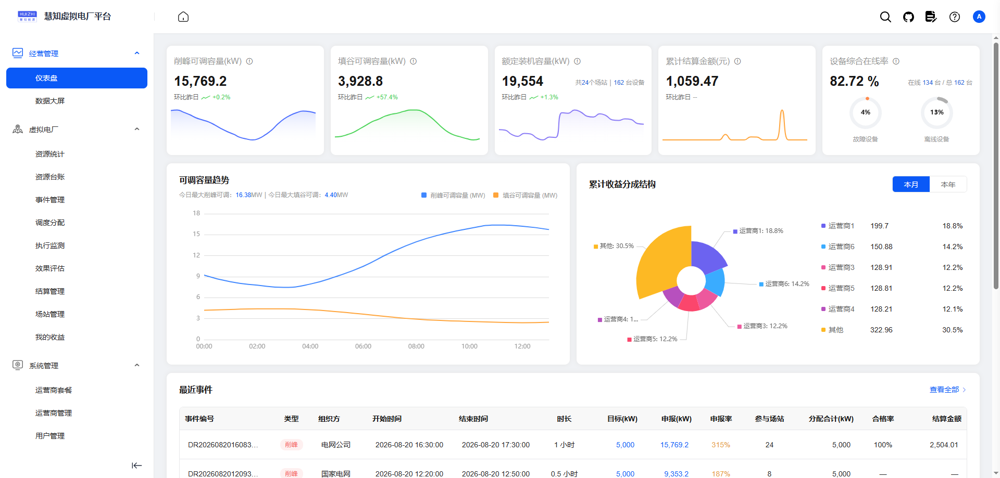

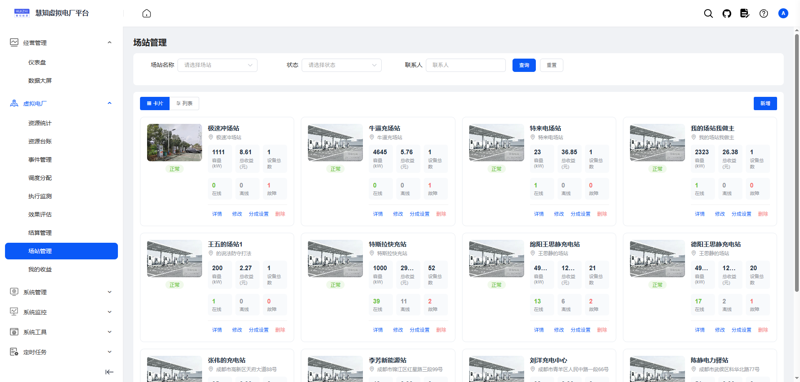

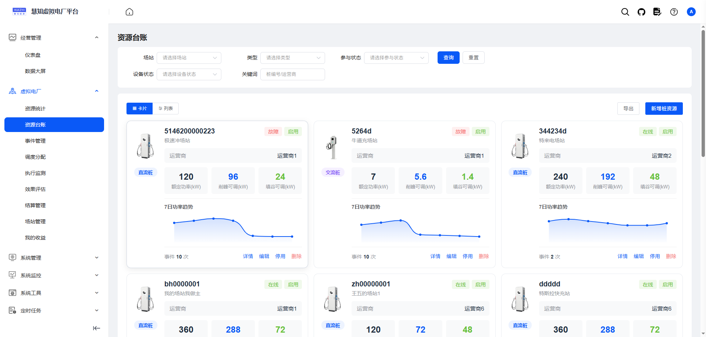

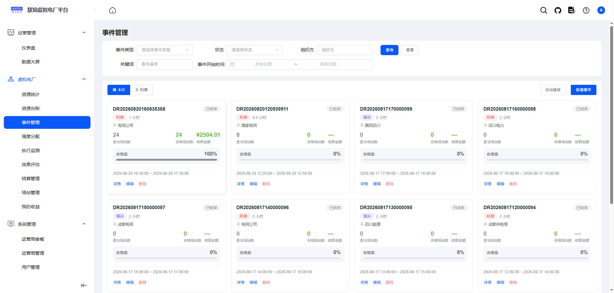

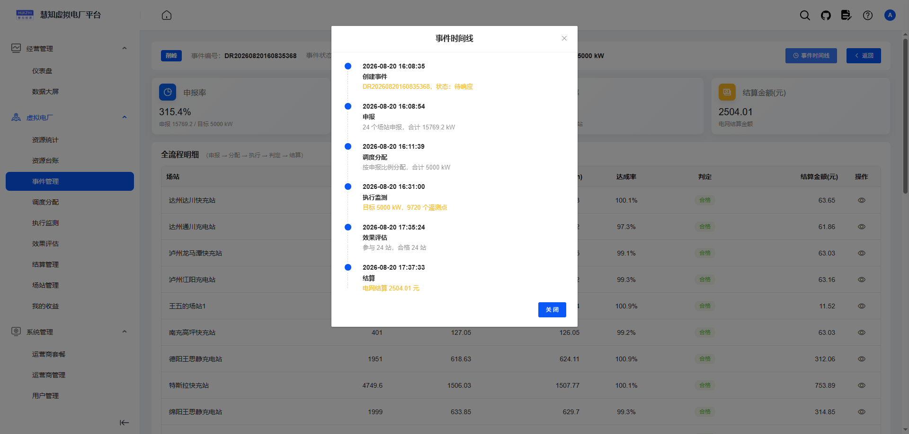

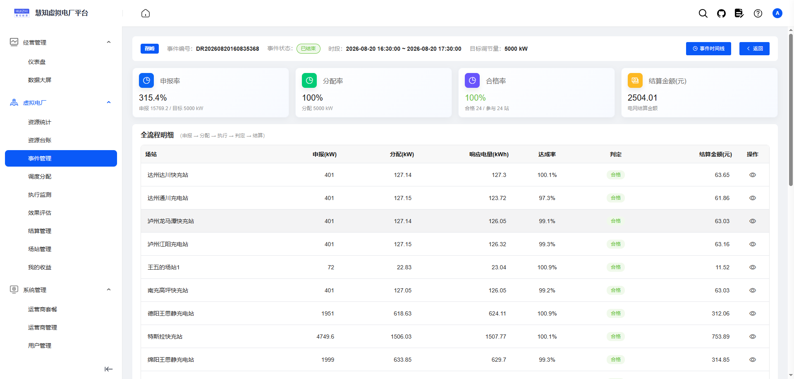

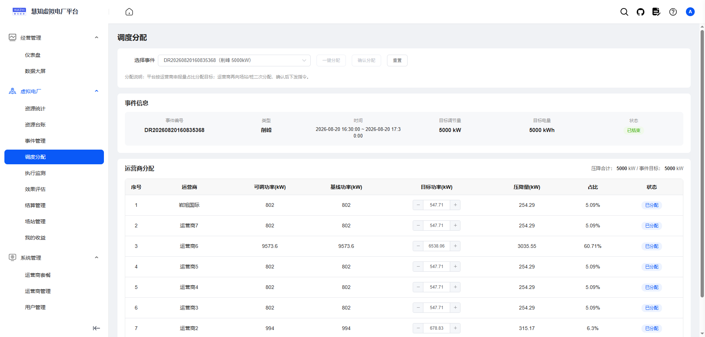

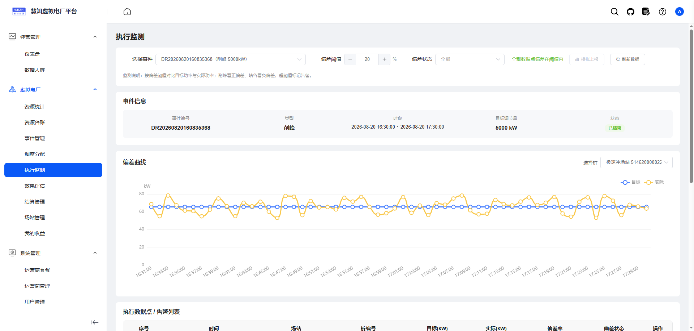

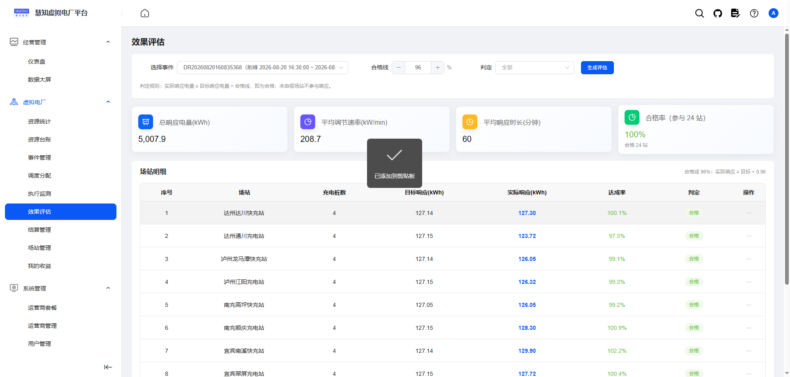

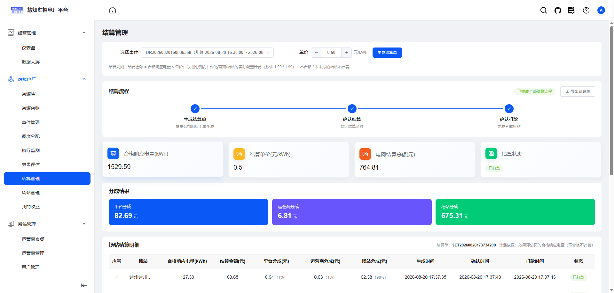

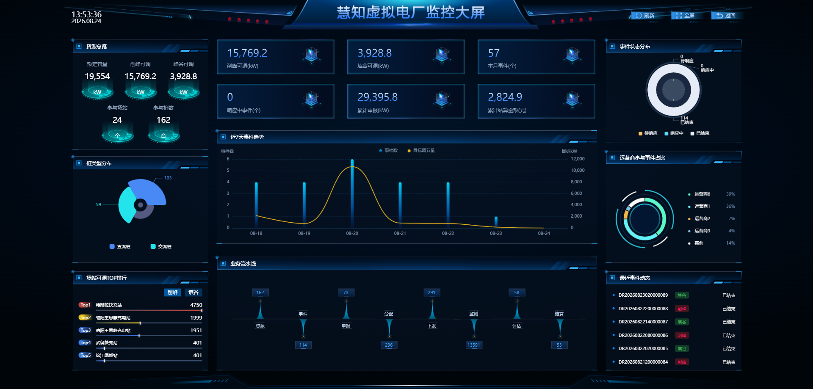

## 启动说明

### 环境要求

- JDK 1.8
- Maven 3.6+
- MySQL 8.0
- Redis
- Nacos 2.1.1（项目已内置，可直接启动）

### 启动顺序

1. 启动 Nacos、MySQL、Redis
2. 优先启动 `vpp-gateway`（网关）和 `vpp-auth`（认证中心）
3. 其余服务可同时启动

### 编译命令

```bash
# 全量编译
mvn clean install -DskipTests

# 增量编译（以 event-service 为例）
mvn -q compile -pl vpp-event-service -am -DskipTests
```

### 前端启动

```bash
cd pc_web
npm install
npm run dev
```

浏览器访问 http://localhost:80

### Host 配置（可选）

如果不想修改 Nacos 配置文件中的地址，可在 hosts 文件中添加以下映射（`127.0.0.1` 替换为本机 IP）：

```
127.0.0.1 vpp-gateway
127.0.0.1 vpp-auth
127.0.0.1 vpp-system
127.0.0.1 vpp-nacos
127.0.0.1 vpp-redis
127.0.0.1 vpp-mysql
```

- Windows：`C:\Windows\System32\drivers\etc\hosts`
- Linux / macOS：`/etc/hosts`
